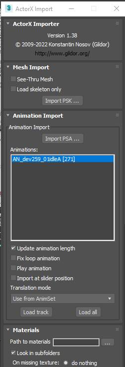
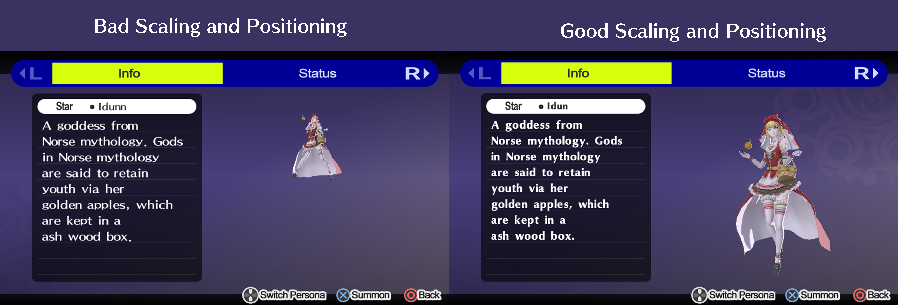
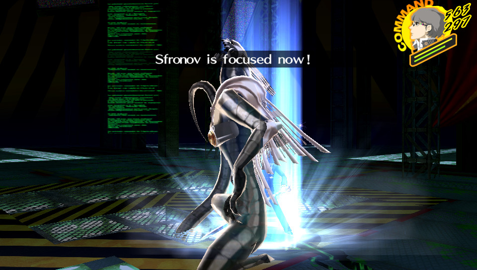

# 👿 SMT V Models

## Required Tools

These are the tools needed for porting SMT V models.

<table><thead><tr><th width="180">Tool</th><th>Usage</th><th></th></tr></thead><tbody><tr><td>UModel</td><td>Needed for dumping SMT V models in the applicable format.</td><td><a href="https://www.gildor.org/en/projects/umodel">https://www.gildor.org/en/projects/umodel</a></td></tr><tr><td>3DS Max</td><td>Modeling program needed for porting models.</td><td></td></tr><tr><td>ActorX Import Script</td><td>The script needed for importing the PSK and PSA file types into 3DS Max.</td><td><a href="https://www.gildor.org/projects/unactorx">https://www.gildor.org/projects/unactorx</a></td></tr><tr><td>GMOConv &#x26; GIMConv</td><td>Needed for converting exported FBX into usable GMO and converting textures.</td><td><a href="https://cdn.discordapp.com/attachments/925531160392658944/1038502426686259240/PSP_Tools.7z">https://cdn.discordapp.com/attachments/925531160392658944/1038502426686259240/PSP_Tools.7z</a></td></tr><tr><td>Sadoaiya</td><td>Needed for optimizing models.</td><td><a href="https://pioziomgames.github.io/programs/sadoaiya">https://pioziomgames.github.io/programs/sadoaiya</a></td></tr><tr><td>Notepad++</td><td>Recommended for fixing materials and changing texture file extensions.</td><td><a href="https://notepad-plus-plus.org">https://notepad-plus-plus.org</a></td></tr><tr><td>GMOView</td><td>Checking your model visually.</td><td><a href="https://cdn.discordapp.com/attachments/925531160392658944/1038502426686259240/PSP_Tools.7z">https://cdn.discordapp.com/attachments/925531160392658944/1038502426686259240/PSP_Tools.7z</a></td></tr><tr><td>GMO2AMD Python Script </td><td>Adding the AMD header to GMO files.</td><td><a href="https://github.com/Timo654/gmo2amd">https://github.com/Timo654/gmo2amd</a></td></tr><tr><td>A complete dump of the game</td><td>For working with any and all files.</td><td>I obviously can't link you this.</td></tr></tbody></table>

## Before you get started

**PLEASE READ THIS!**

Porting SMT V models is a much lengthier process than other models, and there's a chance you can **SKIP ALL OF IT!**&#x20;

Check if the model you're looking to port exists in another medium that is easier to port before you do anything here.

For instance, check if the same design is featured in DX2, and then attempt to port the DX2 model instead.&#x20;

If it doesn't exist in DX2, move on to P5R and check if it either exists in the base game or has been added in a mod. Working with P5R models is much easier than with SMT V models.&#x20;

If it doesn't exist there either, triple-check that no one has ported it to P4G already. There are a few mods that port over SMT V models, and the model you're interested in may already be done for you.

If you've guaranteed that the work isn't already done, continue with the guide.

## Dumping your model

First, you’ll need to dump your models from UModel in PSK and PSA format. Guides online will tell you to dump in GLTF but those aren’t compatible with 3DS Max.&#x20;


Follow this guide, but instead of dumping as GLTF, dump as PSK.


## Model Porting with 3DS Max

Once you have your models dumped in PSK and PSA format, open 3DS Max and run the ActorX Import Script.

For the purpose of this guide, I'll be demonstrating the Angel model, but this information should apply to any model in SMT V.

Make sure “Load Skeleton Only” isn’t checked and press “Import PSK.” Navigate to where your models are located and open the topmost PSK, so not the ones with LOD in the name.

<figure><figcaption></figcaption></figure>

<figure><figcaption>
LOD stands for Level of Detail, basically meaning that the model is less detailed than base. You don't want that.
</figcaption></figure>

Once loaded in, you’ll need to rotate the model 180 degrees on the Z axis so that it faces the right direction when ported to P4G.

Move over to the left side and select the bone with "root" in the name.&#x20;

<figure><figcaption></figcaption></figure>

Next, move up to the top and right-click the rotate option.

<figure><figcaption></figcaption></figure>

In the new window, change the Z rotation to 180, so that the model is facing towards the back of the scene.

Your viewport should look something like this:

<figure><figcaption></figcaption></figure>

Once you're done, move on to the next step.

## Splitting the meshes

Now, we’ll need to split the meshes to prevent errors in P4G, this is a very important step.

Select the mesh data on the left then move over to the right side. It should say “Skin” and “Editable Mesh” on the right side, right-click "Skin" and select Cut.

<figure><figcaption></figcaption></figure>

<figure><figcaption></figcaption></figure>

Next, open up the drop-down of the Editable Mesh and select the term “Element.”

<figure><figcaption></figcaption></figure>

Now, you’ll need to split the mesh in a way that makes sense to you. To make your work easier, press 7 on your keyboard to show the vertex count, then right-click the + and click "Configure Viewports", then click statistics, then change it to “Total + Selection.” You should end up with a viewport like this:

<figure><figcaption></figcaption></figure>

Once that is done, you’ll need to use shift + click to select parts of the mesh, it’s best to do something that is mirrored on both sides or could be considered a separate piece.&#x20;

In our case with working on the Angel model, we’ll split the wings, weapon, arms, legs, cloth, mask, hair, and other bits into their own meshes.&#x20;

Your viewport should have the selected parts in red like this:

<figure><figcaption></figcaption></figure>

Once you’re satisfied with what is selected, press right-click and click detach, and give it an identifiable name, this will split it into its own mesh.&#x20;

<figure><figcaption></figcaption></figure>

To keep your workspace clear, move over to the left side and click the eyeball to hide what you just separated.

Repeat these steps until the mesh is completely invisible.&#x20;

To ensure that all parts are detached at the end, drag and click over the entire size of the window to select any possible leftover meshes, and detach those too.&#x20;

<figure><figcaption>
Leftover bits will be highlighted in Red as shown here/
</figcaption></figure>

Once done, unhide everything so that the entire model is visible.&#x20;

Select each separated mesh one at a time, then move over to the right side and paste the Skin modifier you cut previously.&#x20;

Repeat this until every mesh has a skin modifier. You need to make sure every part has its skin modifier or else specific parts of the model won't animate.

Your model should have returned to the correct rotation. If any parts are facing the opposite direction, click on them and paste the skin modifier back onto them. Your viewport should look something like this:

<figure><figcaption>
Take note of the fact that there are no leftover polys or verts in our original mesh.
</figcaption></figure>

Done? Next, we need to apply the textures to the model with the material editor.

## Material and Texture editing

Move over to the top of the viewer and select this object, it’s the material editor.

<figure><figcaption></figcaption></figure>

A new window will pop up, move to the top left and select the “Picker” option shown here:

<figure><figcaption></figcaption></figure>

Once selected, click anywhere on the model itself and a material tree will pop up.

Zoom out and move to the far left, these boxes on the left in green are what represent your textures.

<figure><figcaption></figcaption></figure>

Double-click on each texture option, and select the option labeled bitmap.

<figure><figcaption></figcaption></figure>

Navigate to your texture folder and select the texture to import it.  In most cases, you'll only need to apply the "Main" texture several times, but in our case, Angel has two textures to apply.

After adding one of the textures, it should show up on the model itself, like this:&#x20;

<figure><figcaption></figcaption></figure>

You should be able to tell which texture goes with what just by the name or by looking at the contents of the image. For example, this isn't correct:

<figure><figcaption></figcaption></figure>

This is:

<figure><figcaption></figcaption></figure>

Once you're done applying the textures, you can move on to exporting the model.

## Exporting the model.

Once satisfied with how the model looks, you’ll need to export with a few specific settings. Export as the settings "FBX ASCII" and "2009." Save to somewhere safe and findable.

<figure><figcaption></figcaption></figure>

<figure><figcaption></figcaption></figure>

Next, go back to the ActorX Importer Script, select “Import PSA” and import one of the three animations you’ll need, those being “Idle,” “Attack,” and “Skill.” Once it's loaded, double-click on it to apply the animation to the model.

<figure><figcaption></figcaption></figure>

Once imported, you’ll notice they went back to their original rotation, select the root bone and rotate everything 180 degrees again and export the same way as last time.

<figure><figcaption></figcaption></figure>

<figure><figcaption></figcaption></figure>

Repeat these steps for the next two animations until all three are exported.

## Converting the model to AMD.

Once finished, launch a command prompt next to where your GMOConv exe is located and type in  a command like this, replacing each fbx with the path to the corresponding one:\
`Gmoconv.exe model.fbx -S -motions attack.fbx skill.fbx attack.fbx skill.fbx idle.fbx`&#x20;

<figure><figcaption></figcaption></figure>

This will automatically convert each model into a GMO and merge it into one model file with little to no effort. Depending on the complexity of the model and the speed of your computer, this could take between a few seconds and a few minutes.

Once finished, open up your model in GMOView to check for any issues. It won't have textures, which is normal, continue on. Press 2 on your keyboard to open up the animation viewer and flip through each animation. You should have a total of 5 animations, going in the order you applied them.

<figure><figcaption></figcaption></figure>

If all looks good, continue with importing textures.

## Texture Importing

Importing textures is incredibly simple, you’ll just need gimconv to convert the PNGs into TM2 for importing.&#x20;

For Playstation Vita users, you’ll most likely need to reduce the Main texture to 512x512 to prevent GPU crashes.&#x20;

For converting textures, we'll use gimconv. Open up a command prompt and pass a command like this to convert your textures to tm2.\
`gimconv (path to png) -o (path to tm2)`

In the last step of converting your FBX files to GMO, you should've also generated a GMS at the same time.

Next, open up your GMS file in your text editor of choice. If you're using Notepad++ as I recommended, try changing the language to just C, then pressing Alt+0 on your keyboard to compress everything down.&#x20;

You’ll need to do two things here:

* **First**, change the extension of your textures to .tm2 in the texture location at the bottom.
*

    <figure><figcaption></figcaption></figure>
* **Second**, fix the materials by copying the material data from a working P4G model. If you don’t do this, your model won’t be visible in-game. Make sure you pick the right materials too, as it may cause the model to be too dark or too bright.
*

    <figure><figcaption>
Incorrect base materials.
</figcaption></figure>

<figure><figcaption>
Correct adjusted materials.
</figcaption></figure>

After both changes are made, reconvert the model back to gmo with Sadoaiya/GMOConv and test again in GMOView. Type a command like this:\
`gmoconv (path to gms)`\
`sadoaiya (path to gms)`

Your model should now have textures when viewing in GMOView. Now is a good time to check if you made any mistakes with your textures.

Next, you’ll need to extend the header to turn your GMO into an AMD to test in-game. You can use the Python script GMO2AMD or Sadoaiya to do this easily. Type in a command like this to do that:\
`python amd.py (path to gmo)`\
`sadoaiya (path to gmo) -A`

Just to play on the safe side, you should be optimizing your models with Sadoaiya to ensure that no potential issues came up during the porting process. In our case, the model has an issue with Vertex colors, so let's remove that before testing in-game. Pass a command like this to remove vertex colors in Sadoaiya:\
`Sadoaiya -C (path to your AMD)`

## Testing in game

The easiest way to test your model in-game is to replace an existing model and check that instead, here's a[ list of what models go with which Persona](https://amicitia.miraheze.org/wiki/Persona\_4\_Golden/data.cpk/model/persona).

Testing in game is the final part of getting models to work properly. You're going to need to check for a lot of things while in the game, so here's a list:

* Model visibility (Does the model actually render?)
* Positioning and scale in the compendium (Is the model centered in the compendium screen?)
* Positioning and scale in the fusion screen (Is the model centered in the fusion screen?)
* Positioning and scale in battles (Is the model positioned correctly in battles? Is it clipping into the floor or too high up?)
* Flashing & Clipping bits (Are any parts of the models acting irregularly?)

Here are a few visual examples of what I mean:

<figure><figcaption>
Example of scaling and positioning. You want the model to be large and centered in both the compendium and fusion screen.
</figcaption></figure>

<figure><figcaption>
Example of bad positioning in battles. Take note of the fact that the model is clipping into the floor here, you don't want that.
</figcaption></figure>

<figure><figcaption>
Example of irregular model behavior.
</figcaption></figure>

Once you've checked all of these, and can verify that they are working perfectly, **congrats!** You've successfully ported a model from SMT V.

In the next section, we'll go through potential problems you may have faced and how to fix them.

## Troubleshooting

Here are some possible solutions to problems you may be having.

* The model is invisible / not rendering.
  * Double-check that you fixed the materials for use in P4G, if you didn't, the model will be invisible in game. The easiest way to do that is to copy the material data from another Persona's GMS file.
* The model is facing the wrong direction in one or more animations.
  * You most likely forgot to rotate the model by 180 degrees again after importing another animation. Go back to 3DS Max and reimport the animation, then rotate it by 180 degrees on the Z axis then export again.
* The model is incorrectly positioned, or scaled in either the compendium or fusion screen.
  * This is due to the stock ps\_model.bin formatting for the model you replaced. To adjust these, you'll need to use [this tool](https://github.com/ShrineFox/P4GPS\_ModelEditor). Dump the file by opening cmbroot.arc in Amicitia and extracting ps\_model.bin. Once that is done, open it in the tool, find the model value by checking [this page](https://amicitia.miraheze.org/wiki/Persona\_4\_Golden/Personas), and make your adjustments there. You can also use[ cheat engine](https://www.cheatengine.org/) and [this tutorial](https://www.youtube.com/watch?v=H\_YEB8efylQ) to make your changes on the fly for later applying to the ps\_model.bin file itself.
* The model is incorrectly positioned during battles.
  * This is a similar problem to the last one, the stock positioning for the model is different than your model. To fix this, you'll need to use 010 Editor, [this template](https://cdn.discordapp.com/attachments/1046042733946617886/1139287641494388816/P4G\_tbl\_2.bt), [these structs](https://cdn.discordapp.com/attachments/1046042733946617886/1139287641121112114/p4g\_enums.bt), and the MODEL.TBL file from init\_free.bin to fix the offset.&#x20;
* Some of the model's parts are blinking in and out of existence or rotating wildly.
  * This is due to missing blend subsets. If you didn't before, try optimizing your model with Sadoaiya to re-add blend subsets if they're missing. Once you're done, retest in-game.
* Part of the model isn't animating.
  * You missed adding a skin modifier back onto a mesh during the 3DS Max part of the process. This is causing one or more of the meshes not to animate when it should. Go back to 3DS Max and check that all of the separated meshes contain a skin modifier.
* The model's animations aren't correct.
  * During the process of converting the FBX files back into a single animated GMO, you messed up. The order of animations should be something like this.
    * Skill (What plays when you cast a magic skill)
    * Phys (What plays when you use a physical skill)
    * Skill
    * Phys
    * Idle (What plays when viewing the model in the compendium.)
  * If the model doesn't match this order, go back and double-check the command you ran when converting your FBX files.

## Wrapping up

Assuming everything is in working order now, you've successfully and fully ported an SMT V model to P4G!&#x20;

\
